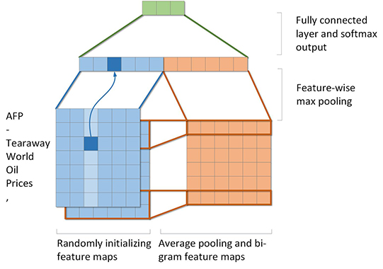
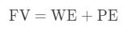
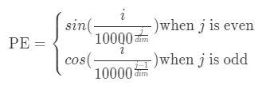
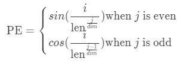
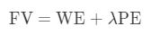
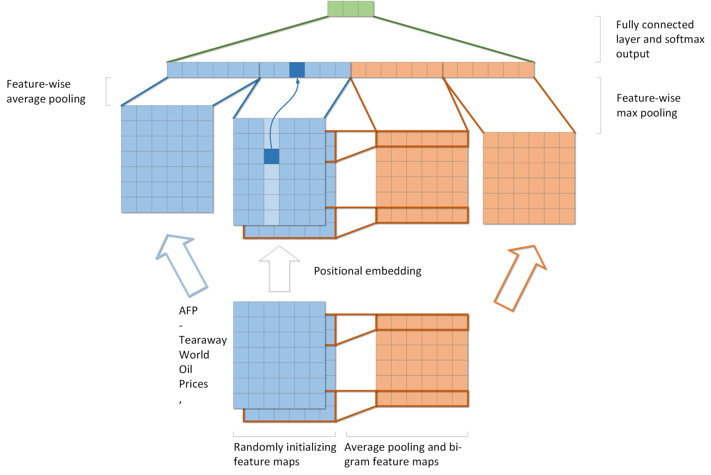
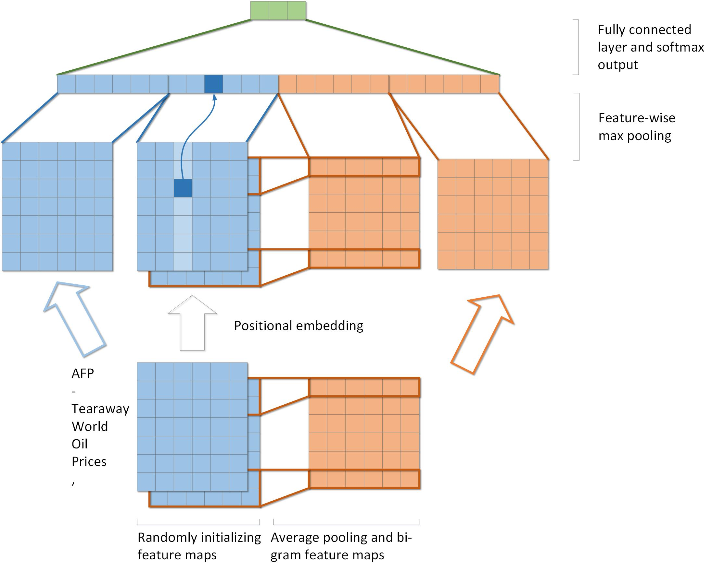

# FNTextModification
## 1. FNText (Original version)
### Description
[FNText: A Fast Neural Model for Efficient Text Classification](emnlp2018.pdf)  
Implementation from original author can be found in [here](https://github.com/Ra1nyHouse/FNText)  
Training set and testing set are examples from original author:
[Training set](src/ag.train.txt),
[Testing set](src/ag.text.txt)
### Structure
  
[Source code](src/fntext_bi.c)
### Results
Acc|200|300|400|500|600
-|-|-|-|-|-|
5|
10|
15|
20|
## 2. FNText with positional embedding
### Description
Inspired by [Attension Is All You Need](http://papers.nips.cc/paper/7181-attention-is-all-you-need), FNText is modified with positional embedding. Positional embedding vectors are directly added with word embedding vectors to construct the final vectors which are fed into the model.  
  
  
Four types of positional embedding have been implemented
* Fixed positional embedding(PE)  

* Learned positional embedding
* Positional embedding with fixed parameter  
  
* Positional embedding with learned parameter
### Structure

### Results
Acc|200|300|400|500|600
-|-|-|-|-|-|
5|
10|
15|
20|
## 3. FNText_max with positional embedding
### Description
* Replacing the average pooling with max pooling
### Structure

### Results
Acc|200|300|400|500|600
-|-|-|-|-|-|
5|
10|
15|
20|
