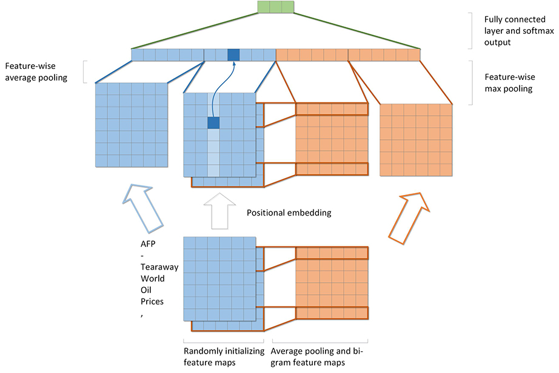
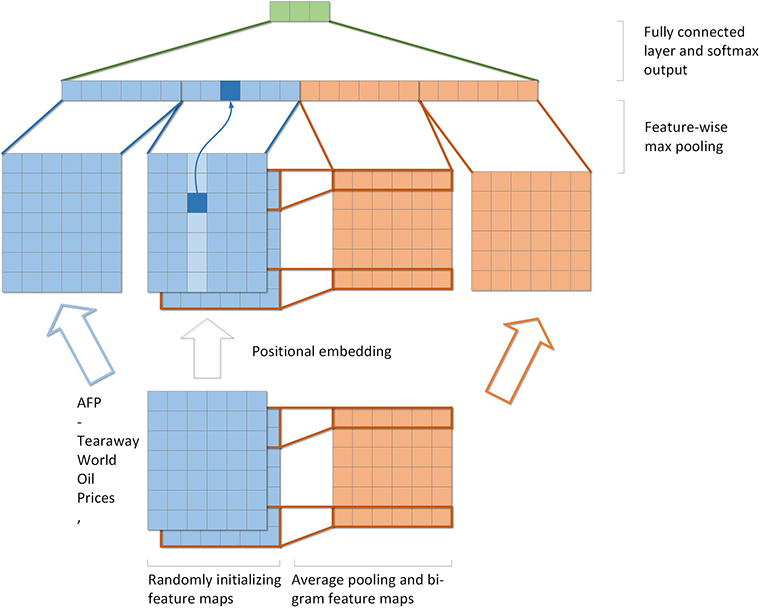

# FNTextModification
## 1. FNText (Original version)
### Description
[FNText: A Fast Neural Model for Efficient Text Classification](emnlp2018.pdf)  
Implementation from original author can be found in [here](https://github.com/Ra1nyHouse/FNText)
### Structure
  
[Source code](src/fntext_bi.c)
### Results
## 2. FNText with positional embedding
### Description
Four types of positional embedding have been implemented
* Fixed posiitonal embedding
* Learned positionl embedding
* Positional embedding with fixed parameter
* Positional embedding with learned parameter
### Structure

### Results
## 3. FNText_max with positional embedding
### Description
* Replacing the average pooling with max pooling
### Structure

### Results
